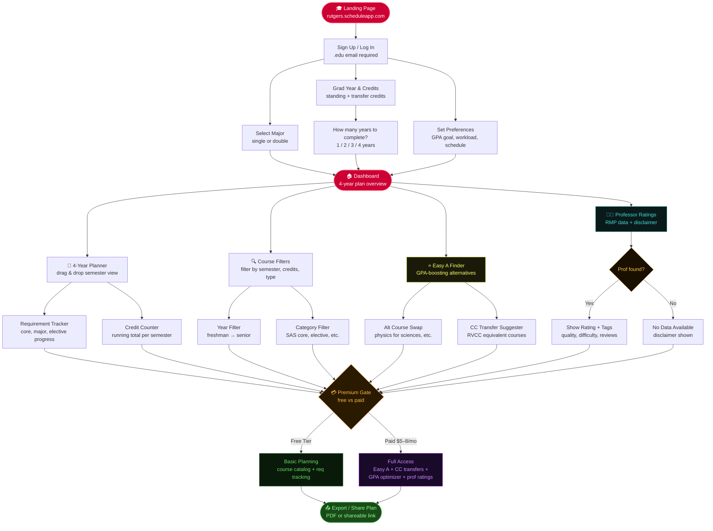

# CLAUDE.md — RutgersPlan

> This file is read automatically at the start of every Claude Code session.
> It defines the project architecture, conventions, data rules, and task scope for this codebase.
> Do not delete or rename this file.

---

## 🎯 Project Overview

**Product:** RutgersPlan — A web-based course planning tool for Rutgers University students
**Goal:** Help students build optimized 4-year graduation plans using smart course suggestions, professor ratings, and community college transfer recommendations
**Scope:** MVP is Rutgers-only. No multi-university support yet.
**URL:** rutgersplan.com (placeholder)

---

## 🗺️ Application Flowchart



---

## 🏗️ Tech Stack

| Layer | Technology | Reason |
|---|---|---|
| Frontend | React + Vite | Fast dev, large ecosystem |
| Styling | Tailwind CSS | Utility-first, no CSS file sprawl |
| Routing | React Router v6 | Standard SPA routing |
| Auth | Supabase Auth | `.edu` email restriction, free tier |
| Database | Supabase (Postgres) | Free tier, pairs with Auth |
| Backend | Supabase Edge Functions | Serverless, no separate backend for MVP |
| Payments | Stripe | Easy subscription setup |
| Deployment | Vercel | One-click deploys, free tier |

---

## 📁 Project Structure

```
rutgers-planner/
├── CLAUDE.md
├── .env.local                 ← Never commit
├── .env.example               ← Commit (no real values)
├── package.json
├── vite.config.js
├── tailwind.config.js
│
├── src/
│   ├── main.jsx
│   ├── App.jsx
│   │
│   ├── pages/
│   │   ├── Landing.jsx
│   │   ├── Auth.jsx
│   │   ├── Onboarding.jsx
│   │   ├── Dashboard.jsx
│   │   ├── Planner.jsx
│   │   ├── EasyA.jsx
│   │   ├── Professors.jsx
│   │   └── Settings.jsx
│   │
│   ├── components/
│   │   ├── layout/
│   │   │   ├── Navbar.jsx
│   │   │   └── Sidebar.jsx
│   │   ├── planner/
│   │   │   ├── SemesterCard.jsx
│   │   │   ├── CourseChip.jsx
│   │   │   └── RequirementBar.jsx
│   │   ├── professor/
│   │   │   ├── ProfCard.jsx
│   │   │   └── ProfNotFound.jsx
│   │   └── shared/
│   │       ├── PremiumGate.jsx
│   │       └── Modal.jsx
│   │
│   ├── hooks/
│   │   ├── useAuth.js
│   │   ├── usePlanner.js
│   │   └── useCourses.js
│   │
│   ├── lib/
│   │   ├── supabase.js
│   │   ├── stripe.js
│   │   └── rmp.js
│   │
│   ├── data/
│   │   ├── rutgers-courses.json
│   │   ├── easy-a-swaps.json
│   │   └── cc-transfers.json
│   │
│   └── utils/
│       ├── creditCounter.js
│       ├── requirementChecker.js
│       └── gpaEstimator.js
│
└── supabase/
    ├── migrations/
    └── functions/
```

---

## 🗄️ Database Schema

```sql
CREATE TABLE profiles (
  id UUID REFERENCES auth.users PRIMARY KEY,
  email TEXT,
  major_primary TEXT,
  major_secondary TEXT,
  grad_year INTEGER,
  years_to_complete INTEGER,   -- 1, 2, 3, or 4
  gpa_goal DECIMAL(3,2),
  credits_completed INTEGER DEFAULT 0,
  is_premium BOOLEAN DEFAULT false,
  stripe_customer_id TEXT,
  created_at TIMESTAMPTZ DEFAULT NOW()
);

CREATE TABLE courses (
  id UUID PRIMARY KEY DEFAULT gen_random_uuid(),
  course_code TEXT UNIQUE,     -- e.g. "01:750:203"
  title TEXT,
  credits INTEGER,
  department TEXT,
  description TEXT,
  is_easy_a BOOLEAN DEFAULT false,
  difficulty_rating DECIMAL(3,2),
  category TEXT,               -- 'SAS Core', 'Major', 'Elective'
  fulfills TEXT[],
  has_cc_equivalent BOOLEAN DEFAULT false,
  created_at TIMESTAMPTZ DEFAULT NOW()
);

CREATE TABLE course_swaps (
  id UUID PRIMARY KEY DEFAULT gen_random_uuid(),
  original_course_id UUID REFERENCES courses(id),
  easier_course_id UUID REFERENCES courses(id),
  reason TEXT,
  verified BOOLEAN DEFAULT false
);

CREATE TABLE cc_equivalencies (
  id UUID PRIMARY KEY DEFAULT gen_random_uuid(),
  rutgers_course_id UUID REFERENCES courses(id),
  cc_name TEXT,
  cc_course_code TEXT,
  cc_course_title TEXT,
  is_verified BOOLEAN DEFAULT false,
  notes TEXT
);

CREATE TABLE plans (
  id UUID PRIMARY KEY DEFAULT gen_random_uuid(),
  user_id UUID REFERENCES profiles(id),
  name TEXT DEFAULT 'My 4-Year Plan',
  is_active BOOLEAN DEFAULT true,
  share_token TEXT UNIQUE,
  created_at TIMESTAMPTZ DEFAULT NOW(),
  updated_at TIMESTAMPTZ DEFAULT NOW()
);

CREATE TABLE plan_courses (
  id UUID PRIMARY KEY DEFAULT gen_random_uuid(),
  plan_id UUID REFERENCES plans(id) ON DELETE CASCADE,
  course_id UUID REFERENCES courses(id),
  year INTEGER,                -- 1, 2, 3, or 4
  semester TEXT,               -- 'Fall', 'Spring', 'Summer'
  status TEXT DEFAULT 'planned',
  grade TEXT
);
```

### RLS Policies

```sql
ALTER TABLE profiles ENABLE ROW LEVEL SECURITY;
ALTER TABLE plans ENABLE ROW LEVEL SECURITY;
ALTER TABLE plan_courses ENABLE ROW LEVEL SECURITY;

CREATE POLICY "Users manage own profile" ON profiles FOR ALL USING (auth.uid() = id);
CREATE POLICY "Users manage own plans" ON plans FOR ALL USING (auth.uid() = user_id);
CREATE POLICY "Users manage own plan courses" ON plan_courses FOR ALL
  USING (plan_id IN (SELECT id FROM plans WHERE user_id = auth.uid()));

CREATE POLICY "Public read courses" ON courses FOR SELECT USING (true);
CREATE POLICY "Public read swaps" ON course_swaps FOR SELECT USING (true);
CREATE POLICY "Public read cc" ON cc_equivalencies FOR SELECT USING (true);
```

---

## 🔐 Auth Rules

- Email **must** end in `@rutgers.edu` — enforce on client AND Supabase Auth hook
- JWT issued by Supabase, stored in httpOnly cookie
- No OAuth for MVP — email/password only

---

## 💳 Free vs Premium

| Feature | Free | Premium ($5–8/mo) |
|---|---|---|
| 4-year planner | ✅ | ✅ |
| Course catalog | ✅ | ✅ |
| Requirement tracker | ✅ | ✅ |
| Easy A finder | ❌ | ✅ |
| Alt course swaps | ❌ | ✅ |
| CC transfer suggestions | ❌ | ✅ |
| Professor ratings | ❌ | ✅ |
| GPA optimizer | ❌ | ✅ |
| Export to PDF | ❌ | ✅ |
| Shareable plan link | ❌ | ✅ |

Wrap all premium features in `<PremiumGate>`. Check `profile.is_premium`. On click → `/settings#upgrade` → Stripe Checkout.

---

## 🧠 Coding Rules (Always Follow)

- **Functional components only** — no class components ever
- **Named exports** for components, **default exports** for pages only
- **Tailwind only** for styling — no inline styles, no extra CSS files
- **All Supabase queries** live in `/src/hooks/` — never directly in components
- **Always handle** loading, error, and empty states in every data-fetching component
- **async/await with try/catch** — no `.then()` chains
- **Never hardcode** course data in components — use `/src/data/` or Supabase
- **Never check** `is_premium` inline in pages — always use `<PremiumGate>` wrapper
- **Never call or scrape RMP's API** — link out to RMP only, always show disclaimer

### Rutgers Brand Colors (tailwind.config.js)
```js
colors: {
  scarlet: '#CC0033',
  'rutgers-gray': '#5F6163',
}
```

### Environment Variables (.env.local)
```
VITE_SUPABASE_URL=
VITE_SUPABASE_ANON_KEY=
VITE_STRIPE_PUBLISHABLE_KEY=
```

---

## ⚠️ Legal Guardrails

- **Never** pull data from WebReg, Degree Navigator, or any Rutgers-authenticated system
- **Never** store or proxy RateMyProfessors data — link out only
- **Always show** on RMP features: *"Professor ratings are sourced from RateMyProfessors. Data may be outdated or inaccurate. Not guaranteed."*
- **Always show** on CC transfer features: *"Transfer credit acceptance is subject to Rutgers approval. Verify with your academic advisor before enrolling."*
- Rutgers public course catalog at `schedule.rutgers.edu` is fine to use

---

## 📎 Reference Links

- Rutgers Schedule of Classes: https://schedule.rutgers.edu
- Rutgers SAS Core Requirements: https://sasundergrad.rutgers.edu/degree-requirements/sas-core
- RVCC Transfer Equivalencies: https://www.raritanval.edu/transfer
- Supabase Docs: https://supabase.com/docs
- Stripe Checkout: https://stripe.com/docs/checkout/quickstart
- RateMyProfessors: https://www.ratemyprofessors.com

---

*RutgersPlan MVP v0.1 — March 2026*
