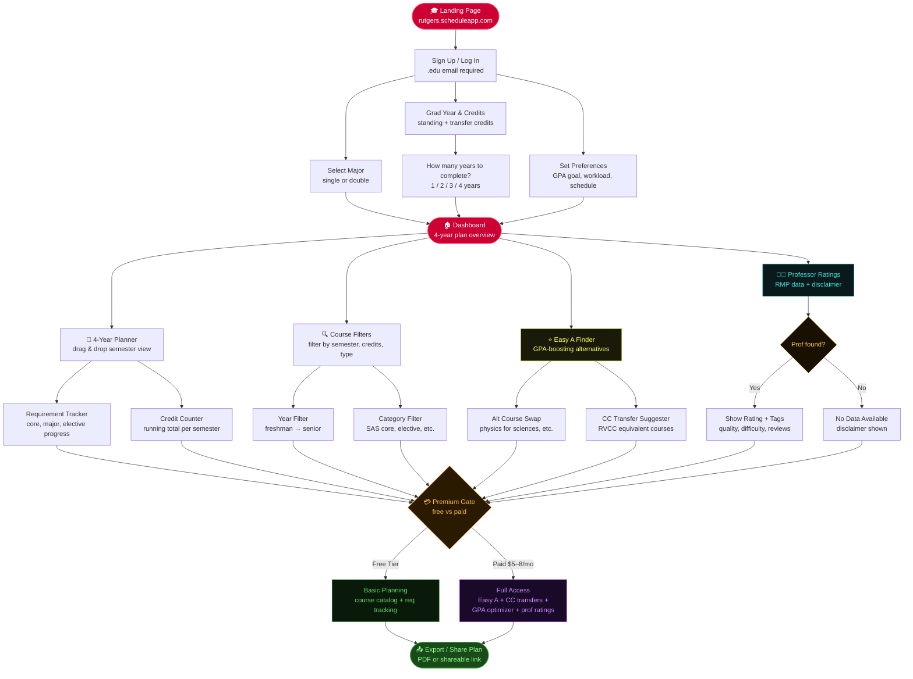

# RutgersPlan — MVP Agent Prompt Guide

> This document is for YOU, the developer.
> Use it to prompt Claude Code effectively throughout the build.
> It contains the master prompt, phased build prompts, CLAUDE.md instructions, and the app flowchart.

---

## 1. Master Context Prompt

> Paste this at the start of every new Claude Code session, OR place it inside your CLAUDE.md so it's loaded automatically.

```
You are a senior fullstack engineer helping build RutgersPlan — a web app that helps
Rutgers University students build optimized 4-year course plans.

Tech stack: React + Vite, Tailwind CSS, Supabase (Auth + Postgres + Edge Functions),
Stripe for payments, deployed on Vercel.

Key rules you must always follow:
- Functional React components only, no class components
- Named exports for components, default exports for pages
- All Supabase queries go in /src/hooks/ — never inline in components
- Tailwind utility classes only — no inline styles or extra CSS files
- Always handle loading, error, and empty states
- Never check is_premium inline — always use <PremiumGate> component
- Never scrape or call RateMyProfessors API — link out only
- Never touch WebReg, Degree Navigator, or any Rutgers-authenticated system
- Always show legal disclaimers on RMP and CC transfer features
- Use async/await with try/catch — no .then() chains
- Rutgers brand: scarlet = #CC0033, gray = #5F6163

The CLAUDE.md file in the project root contains full schema, file structure,
and all conventions. Read it before writing any code.

Current task: [DESCRIBE YOUR TASK HERE]
```

---

## 2. Application Flowchart

Reference this when prompting Claude Code to build any specific screen or feature.
Each node = one page or modal in the app.



---

## 3. CLAUDE.md — What To Include & How To Build It

> `CLAUDE.md` lives in your project root. Claude Code reads it automatically at
> session start. Think of it as permanent memory for your AI coding agent.

### What belongs in CLAUDE.md

| Section | What to write |
|---|---|
| **Project Overview** | One paragraph: what the app is, who it's for, current scope |
| **Tech Stack** | Table of every layer with the exact package/service name |
| **Flowchart** | Embed the Mermaid flowchart above — gives Claude spatial context of all screens |
| **File Structure** | Full directory tree with comments on what each file does |
| **Database Schema** | Complete SQL — tables, columns, types, foreign keys, RLS policies |
| **Auth Rules** | Email restrictions, session handling, what's protected |
| **Free vs Premium table** | Exact feature gate list so Claude never builds premium features as free |
| **Coding Rules** | Non-negotiable conventions: component style, data fetching patterns, styling rules |
| **Legal Guardrails** | Hard stops: what data sources are off-limits and what disclaimers are required |
| **Reference Links** | Rutgers catalog, Supabase docs, Stripe docs, RMP — anything Claude might need to look up |

### What does NOT belong in CLAUDE.md

- Your model setup or local environment configuration (keep that in your shell config)
- API keys or secrets (use `.env.local`)
- Anything that changes per-task — put that in your per-session prompt instead
- Marketing copy or business strategy — that's for you, not the agent

### How to keep CLAUDE.md up to date

Update it whenever you:
- Add a new table to the database
- Add a new page or major component
- Change a convention (e.g. switch from React Context to Zustand)
- Add a new third-party service
- Change the premium feature gate list

A stale CLAUDE.md is worse than none — Claude will confidently build against outdated info.

---

## 4. Phased Build Prompts

Copy-paste these into Claude Code per phase. Replace `[brackets]` with specifics.

---

### Phase 1 — Foundation

```
Read CLAUDE.md first.

Set up the project foundation:
1. Initialize Vite + React with Tailwind CSS
2. Install dependencies: react-router-dom, @supabase/supabase-js, stripe
3. Create the full folder structure from CLAUDE.md exactly
4. Set up App.jsx with React Router — placeholder pages for all routes:
   /, /auth, /onboarding, /dashboard, /planner, /easyA, /professors, /settings
5. Create .env.example with all required variables (no real values)
6. Create lib/supabase.js initializing the Supabase client from env vars
7. Add Rutgers scarlet and rutgers-gray to tailwind.config.js

Do not build any UI yet. Foundation only.
```

---

### Phase 2 — Auth

```
Read CLAUDE.md first.

Build the Auth page (/auth):
- Sign up and log in tabs
- Email input must validate that the domain ends in @rutgers.edu
  - Show inline error: "Only Rutgers email addresses (@rutgers.edu) are allowed"
- Password input with show/hide toggle
- On successful signup: create a row in the profiles table
- On successful login: redirect to /dashboard if profile is complete, else /onboarding
- Use Supabase Auth (email/password)
- Build a useAuth hook in /src/hooks/useAuth.js that exposes: user, profile, loading, signIn, signUp, signOut
- Protect all routes except / and /auth using a PrivateRoute wrapper component
```

---

### Phase 3 — Onboarding

```
Read CLAUDE.md first.

Build the Onboarding flow (/onboarding) as a 3-step wizard:
  Step 1: Select major (primary required, secondary optional). Dropdown from a hardcoded
          list of Rutgers majors for now.
  Step 2: Current credits completed + how many years to complete degree (1/2/3/4 selector).
          Calculate and display suggested grad year based on input.
  Step 3: Preferences — GPA goal (slider 2.0–4.0) and preferred max credits per semester
          (9 / 12 / 15 / 18).

On completion:
- Save all fields to the profiles table via upsert
- Create a default plan row in plans table
- Redirect to /dashboard

Show a progress indicator (Step 1 of 3) at the top.
Do not allow skipping steps.
```

---

### Phase 4 — Dashboard + Planner

```
Read CLAUDE.md first.

Build the Dashboard (/dashboard):
- Sidebar nav with links to: Dashboard, Planner, Easy A, Professors, Settings
- Top bar showing user's name and major
- Summary cards: total credits planned, credits remaining, current GPA goal, semesters left
- Quick link buttons to each main feature

Build the 4-Year Planner (/planner):
- Grid layout: rows = Year 1–4, columns = Fall / Spring / Summer
- Each cell is a SemesterCard component showing:
  - List of CourseChip components (course code + title + credits)
  - Credit total for that semester
  - Add Course button that opens a modal with course search
- RequirementBar component at the top showing progress toward:
  SAS Core, Major Requirements, Free Electives — as colored progress bars
- Courses pulled from Supabase plan_courses table joined with courses table
- Drag-and-drop between semesters using @dnd-kit/core (install it)
```

---

### Phase 5 — Smart Features (Premium)

```
Read CLAUDE.md first.

Build the Easy A Finder (/easyA) — PREMIUM GATED:
- Wrap the entire page content in <PremiumGate>
- Show a searchable list of courses flagged is_easy_a = true
- For each, show the Alt Course Swap if one exists in course_swaps table:
  "Instead of [original], take [easier] — [reason]"
- Show CC Transfer suggestions from cc_equivalencies table:
  "This course can be taken at [cc_name] as [cc_course_code]: [cc_course_title]"
  Always show disclaimer below CC suggestions.

Build Professor Ratings feature on /professors — PREMIUM GATED:
- Search input for professor name
- On search: show a button linking to
  https://www.ratemyprofessors.com/search/professors?q=[name]+rutgers
  Opens in new tab.
- If the name field is empty or user hasn't searched, show <ProfNotFound /> placeholder
- Always show RMP disclaimer below results

Build the <PremiumGate> component in /src/components/shared/PremiumGate.jsx:
- Accepts children prop
- If profile.is_premium is true: render children normally
- If false: render a blurred overlay with "Upgrade to Premium" CTA button
  that links to /settings#upgrade
```

---

### Phase 6 — Payments

```
Read CLAUDE.md first.

Build the Settings page (/settings):
- Account section: display email, major, grad year (read-only for now)
- Subscription section:
  - If free: show plan comparison table (from CLAUDE.md free vs premium table)
    and a "Upgrade — $[price]/mo" button
  - If premium: show "Active Premium" badge and a "Manage Subscription" link
    to Stripe customer portal

Integrate Stripe Checkout:
- On upgrade click: call a Supabase Edge Function at /functions/create-checkout
  that creates a Stripe Checkout session and returns the URL
- Redirect user to Stripe Checkout URL
- On success: Stripe webhook calls /functions/stripe-webhook
  which updates is_premium = true and stores stripe_customer_id on profiles table
- On cancel: redirect back to /settings with a "Checkout cancelled" toast

Create both Edge Functions in /supabase/functions/.
Use STRIPE_SECRET_KEY as a Supabase secret (not in .env.local).
```

---

### Phase 7 — Export + Polish

```
Read CLAUDE.md first.

Build Export to PDF (premium gated):
- Add an "Export Plan" button on /planner
- On click: generate a clean PDF of the user's 4-year plan using @react-pdf/renderer
- PDF should show: user name, major, grad year, and a semester-by-semester course list
- Trigger browser download of the PDF

Build Shareable Plan Link (premium gated):
- Add a "Share Plan" button on /planner
- On click: if share_token is null, generate one (nanoid) and save to plans table
- Display a copyable URL: https://rutgersplan.com/plan/[share_token]
- Build a public route /plan/:token that renders a read-only version of the planner
  (no auth required, no editing)

Final polish pass:
- Confirm all pages are mobile responsive
- Add loading skeletons to all data-fetching components
- Add toast notifications for all save/error/success actions (use react-hot-toast)
- Run through the full user flow: signup → onboarding → planner → upgrade → export
```

---

## 5. Tips for Vibe Coding This App

**Be specific about files.** Instead of "build the planner", say "build `src/pages/Planner.jsx` and the three components it needs." Claude Code works best with clear file targets.

**One phase at a time.** Don't dump multiple phases into one prompt. Finish Phase 1 entirely before prompting Phase 2.

**Review before continuing.** After each phase, manually test the feature and note anything broken. Add it to the next prompt as: "Also fix: [issue]".

**Keep CLAUDE.md current.** If you change a table, update CLAUDE.md and tell Claude Code: "I've updated CLAUDE.md — re-read it before continuing."

**Use the flowchart as a map.** If you're confused about what to build next, look at the flowchart. Each box is one prompt.

---

*RutgersPlan — MVP Agent Prompt Guide v0.1 — March 2026*